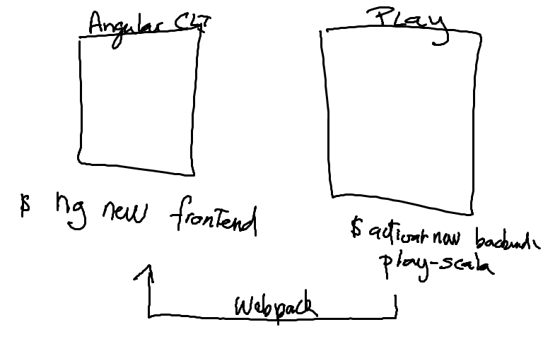

# play-angular-cli


## Prerequisites

* Install activator and sbt
* Install node, npm and angular-cli

## Goal



## Setup

### PlayFramework backend

```
$ activator new backend play-scala
```

## Configuration

`replace` the source code in controllers.HomeController.scala by  

```scala
package controllers

import javax.inject.{Inject,Singleton}

import play.api.{Environment,Mode}
import play.api.mvc.{Controller,Action}

// Import required for injection
import play.api.libs.ws.WSClient
import scala.concurrent.ExecutionContext

/**
 * This controller creates an `Action` to handle HTTP requests to the
 * application's home page.
 */
@Singleton
class HomeController @Inject()(ws: WSClient, environment: Environment)(implicit ec: ExecutionContext) extends Controller {

  def index = Assets.versioned(path="/public/dist", "index.html")

  def dist(file: String) = environment.mode match {
    case Mode.Dev => Action.async {
      ws.url("http://localhost:4200/dist/" + file).get().map { response =>
        Ok(response.body)
      }
    }
    // If Production, use build files.
    case Mode.Prod => Assets.versioned(path="/public/dist", file)
  }

}
```

`add` the below source code to `conf/routes`   

```yaml

<...>

# index.html
GET     /                           controllers.HomeController.index

# Bundle files generated by Webpack
GET     /dist/*file                 controllers.HomeController.dist(file)
```

`add` the below source code in `build.sbt`

```sbt

<...>

/* ================================= NG BUILD ================================== */

val frontEndProjectName = "frontend"
val backEndProjectName = "backend"
val distDirectory = ".." + backEndProjectName + "public/dist"

// Starts: angularCLI build task
val frontendDirectory = baseDirectory {_ /".."/frontEndProjectName}

val ng = sys.props("os.name").toLowerCase match {
  case os if os.contains("win") => "cmd /c ng"
  case _ => "ng"
}

val params = sys.props("os.name").toLowerCase match {
  case os if os.contains("win") => " build --deploy-url /dist --output-path ..\\backend\\public\\dist --progress "
  case _ => " build --deploy-url /dist --output-path ../backend/public/dist --progress "
}

val ngBuild = taskKey[Unit]("ng build task.")
ngBuild := { Process( ng + params , frontendDirectory.value) ! }
(packageBin in Universal) <<= (packageBin in Universal) dependsOn ngBuild
// Ends.

```

# Frontend

### angular-cli frontend
```bash
$ ng new frontend --style=scss
```

## Running (Prod)

```
$ sbt dist
```

```
$ sbt playGenerateSecret
$ export PLAY_APP_SECRET="put the result here"
```

```
$ unzip target/universal/backend-1.0-SNAPSHOT.zip
$ backend-1.0-SNAPSHOT/bin/backend -Dplay.crypto.secret=$PLAY_APP_SECRET
```
